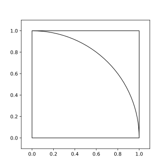

# Monte Carlo Integration

_by Christoph Heindl, 2022_ 
https://github.com/cheind/monte-carlo-integration 
_Although this is a summary of my research notebook, I hope others will find it useful too_

The purpose of this document is to present Monte Carlo integration, a method to approximate the value of the definite integral

$$
\int\limits_a^b g(x)dx.
$$

The Monte Carlo approach is to frame the above integral as an expectation over a random variable for which we know that unbiased estimators exist.

Assume consider $x$ to be random $x \sim X$ with pdf $f_X(x)$. Multiply and divide the right hand side by $f_X(x)$

$$
    \int\limits_a^b \frac{g(x)}{f_X(x)}f_X(x)dx.
$$

Assume $f_X(x)$ is zero everywhere but in $[a,b]$. Then, we might change the bounds of integration to

$$
\int\limits_{-\infty}^{\infty}\frac{g(x)}{f_X(x)}f_X(x)\,dx.
$$

From [LOTUS](https://en.wikipedia.org/wiki/Law_of_the_unconscious_statistician) we recognize the above as the expected value of

$$
\mathbb{E}\left[\frac{g(X)}{f_X(X)}\right].
$$

From asymptotic theory we know that an unbiased estimator for the expectation is

$$
\int\limits_a^b g(x)\,dx = \mathbb{E}\left[\frac{g(X)}{f_X(X)}\right] \approx \frac{1}{N}\sum\limits_{i=1}^N\frac{g(\hat{x}_i)}{f_X(\hat{x}_i)},
$$

where $\hat{x}_i$ is the i-th random sample out of $N$ _iid_ samples. We also know that as we increase $N$ our approximation approaches the true value of the integral.

If we assume $X$ is distributed uniformly on $[a,b]$ we have $f_X(x)=\frac{1}{b-a}$ and get

$$
\frac{1}{N}\sum\limits_{i=1}^N g(\hat{x}_i)(b-a).
$$

Geometrically, that equals taking the average area of rectangles having length $b-a$ and height $g(\hat{x}_i)$.

## Multivariate cases and areas of circles

The above result is useful in itself as it allows us to numerically integrate any function by random sampling. In this section we extend the approach to multiple dimensions and show how it relates to indicator functions.

### Single variable approach

Lets start with refresheer and a direct application of the above results: compute the area of a circle by integration. We know that the area of the unit circle can be written as an integral over its circumference.

$$
A_{\textrm{circle}}=\int\limits_0^1 2\pi r\,dr
$$

This equation is already in the desired form and we can directly compute an approximation for the area of the circle

$$
A_{\textrm{circle}} \approx \frac{1}{N}\sum\limits_{i=1}^N 2\pi\hat{r}_i(1-0).
$$

Nothing spectacular new here.

### Multivariate approach

A more insightful way for our purposes is to consider a different integral. Here is quadrant of a unit circle

    

The area of this quadrant can be written as the double integral

$$
A_q = \int\limits_0^1\int\limits_0^{\sqrt{1-x^2}}\,dydx
$$

Conceptionally we integrate small squares of area $dydx$. While $x$ runs from zero to one, we condition upper limit of $y$ on the $x$-position by rearranging the equation of a unit circle $x^2+y^2=1$.

Using the indicator function

$$
\mathbb{I}_{x^2+y^2\le1} := \begin{cases}
1 & x x^2+y^2\le1 \\
0 & \, \text{else}
\end{cases}
$$

we might equivalenty write

$$
A_q = \int\limits_0^1\int\limits_0^1 \mathbb{I}_{x^2+y^2\le1}\,dydx
$$

Which is now in similar form as the initial definite integral $\int\limits_0^1\int\limits_0^1 g(x,y)\,dydx$. So, let $X$ and $Y$ be random variables whose joint distribution is $f_{X,Y}$. For the same arguments as in the univariate case we can rewrite this integral as the expectation of

$$
\mathbb{E}_{X,Y}\left[\frac{g(X,Y)}{f_{X,Y}(X,Y)}\right].
$$

and hence an unbiased estimator for the $A_q$ is

$$
A_q \approx \frac{1}{N}\sum\limits_{i=1}^N \frac{g(\hat{x}_i,\hat{y}_i)}{f_{X,Y}(\hat{x}_i,\hat{y}_i)}.
$$

If $X$ and $Y$ are independent, i.e. $f_{X,Y}=f_X(x)f_Y(y)$ and uniform on $[0,1]$ we have

$$
A_q \approx \frac{(1-0)(1-0)}{N}\sum\limits_{i=1}^N g(\hat{x}_i,\hat{y}_i)= \frac{1}{N}\sum\limits_{i=1}^N \mathbb{I}_{x^2+y^2\le1}
$$

and $A_{\textrm{circle}}=4A_q$.

#### Generalization

Given an indicator function $\mathbb{I}$ that determines whether a point $(x,y)$ is inside a shape S and a bounding rectangular region B, we can approximate the area of S by

$$
\begin{equation}
\begin{split}
A_{\textrm{S}} &= \int\limits_a^b\int\limits_c^d \mathbb{I}(x,y)\,dydx\\
&\approx \frac{(b-a)(d-c)}{N}\sum\limits_{i=1}^N \mathbb{I}(x,y)
\end{split}
\end{equation}
$$

and similarily for more than two dimensions.

The natural interpretation of this is to sample points from the boundary region and estimate the area of S by the area of B times the ratio of points inside S divided by total number of points.

## Remarks

Up to this point we made extensively use of the uniform distribution for $f_X(x)$, because its easiy to visualize and leads to simple geometric concepts. Keep in mind, though, that other distributions are suited equally well as long the pdf is zero outside the integration bounds $[a,b]$. In fact the uniform might be a bad joice (in terms of approximation error and convergence) if most of the 'mass' of $g(x)$ is concentrated in few sub-regions of $[a,b]$. Consider looking into importance sampling in case this is of interest to you.

## References

-   Taboga, Marco (2021). "The Monte Carlo method", Lectures on probability theory and mathematical statistics. Kindle Direct Publishing. Online appendix. https://www.statlect.com/asymptotic-theory/Monte-Carlo-method.

## Todo

-   Prove that the Monte Carlo estimator is an unbiased estimator.
-   Add importance weighting to speed up convergence.
